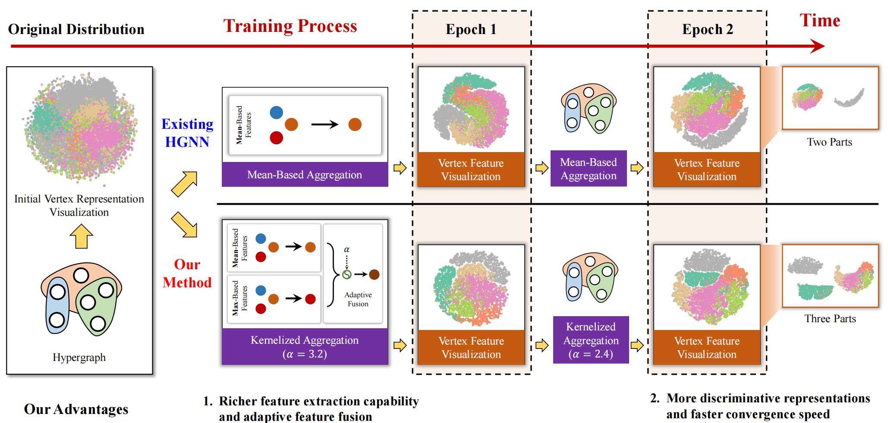
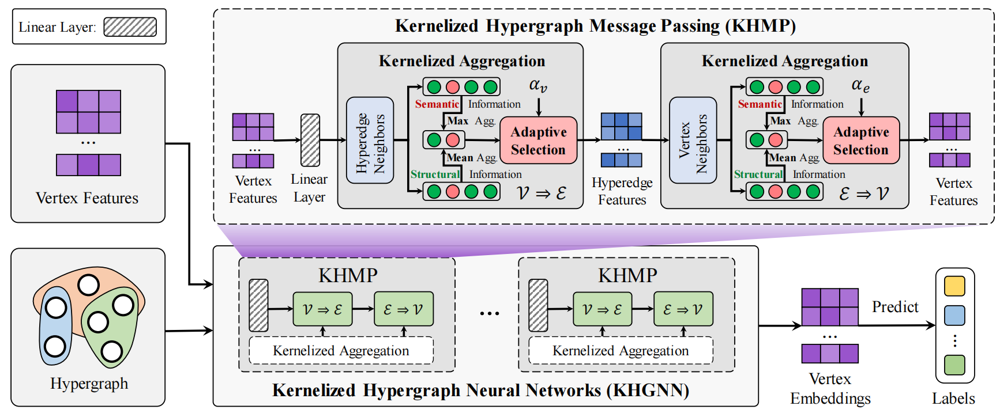

# KHGNN: Kernelized Hypergraph Neural Networks

[](https://ieeexplore.ieee.org/abstract/document/11063418)
[](https://www.python.org/)
[](https://pytorch.org/)
[](https://github.com/iMoonLab/DeepHypergraph)

This repository contains the official implementation of **"Kernelized Hypergraph Neural Networks"** published in **IEEE Transactions on Pattern Analysis and Machine Intelligence (TPAMI)**.

## 🔥 Overview

Kernelized Hypergraph Neural Networks (KHGNN) introduces a novel approach to hypergraph learning by incorporating kernel methods into hypergraph neural networks. Our method enhances the representation learning capability on hypergraph-structured data through adaptive kernel functions.

<div align="center">
  
  <p><em>KHGNN Overview: Kernelized hypergraph neural network architecture</em></p>
</div>

### Key Features

- **Kernelized Hypergraph Convolution**: Novel convolution operation using adaptive kernel functions
- **Flexible Kernel Types**: Support for polynomial, adaptive polynomial, and mean kernels
- **Comprehensive Evaluation**: Extensive experiments on multiple benchmark datasets
- **Easy Integration**: Compatible with existing hypergraph neural network frameworks


## 🏗️ Model Architecture

The KHGNN architecture consists of:

1. **Kernel Hypergraph Convolution Layer**: Core convolution with adaptive kernels
2. **Node Normalization**: Stabilizes training dynamics
3. **Residual Connections**: Enables deep architectures
4. **Adaptive Parameters**: Learnable kernel parameters (p, μ)

<div align="center">
  
  <p><em>Detailed KHGNN architecture showing kernel convolution layers and adaptive parameters</em></p>
</div>


## 📝 Code Structure

```
KHGNN/
├── khgnn_model.py          # Main KHGNN model implementation
├── trans_train.py          # Transductive training script
├── prod_train.py           # Inductive training script  
├── utils.py                # Data loading and utility functions
├── trans_config.yaml       # Transductive experiment config
└── prod_config.yaml        # Inductive experiment config
```


## 📦 Installation

### Prerequisites

- Python >= 3.8, < 3.11
- uv (Python package manager, recommended)

### Install uv (if not already installed)

```bash
# On Windows
powershell -c "irm https://astral.sh/uv/install.ps1 | iex"

# On macOS and Linux
curl -LsSf https://astral.sh/uv/install.sh | sh

# Or using pip
pip install uv
```

### Quick Install

```bash
# Clone the repository
git clone https://github.com/iMoonLab/KHGNN.git
cd KHGNN

# Install dependencies using uv (recommended)
uv sync

# Or install with pip (if not using uv)
pip install -e .
```

### Development Setup

```bash
# Install development dependencies (includes black, isort, etc.)
uv sync --group dev
```

## 🚀 Quick Start

### Basic Usage

```python
import torch
import torch.nn.functional as F
from dhg import Hypergraph
from khgnn_model import KerHGNN
from utils import load_data

# Load dataset
data, edge_list = load_data('cora')
features = data['features']
labels = data['labels']

# Create hypergraph
hg = Hypergraph(data['num_vertices'], edge_list)

# Initialize KHGNN model
model = KerHGNN(
    in_channels=features.shape[1],
    hid_channels=64,
    num_classes=labels.max().item() + 1,
    num_layer=2,
    kernel_type='poly',  # 'poly', 'apoly', or 'mean'
    p_min=-0.5,
    p_max=2.0,
    drop_rate=0.5
)

# Forward pass
model.eval()
with torch.no_grad():
    output = model(features, hg)
    probs = F.softmax(output, dim=1)
```

### Quick Example

Try the provided example script to see KHGNN in action:

```bash
# Run the example script
uv run example.py
```

This will demonstrate:
- Loading a sample dataset
- Initializing the KHGNN model
- Running a forward pass
- Displaying sample predictions

### Training

```bash
# Transductive learning
uv run trans_train.py

# Inductive learning  
uv run prod_train.py

# Multi-experiment runs
uv run trans_multi_train.py
uv run prod_multi_exp.py
```

## 📊 Supported Datasets

Our implementation supports various hypergraph datasets:

### Citation Networks
- **Cora**, **Citeseer**, **Pubmed** - Classic citation networks
- **DBLP4k** - DBLP bibliography network (conference, paper, term views)

### Co-authorship Networks  
- **Coauthorship-DBLP** - Author collaboration networks
- **Coauthorship-Cora** - Cora author networks

### Other Domains
- **News20** - 20 Newsgroups text classification
- **IMDB4k** - Movie database
- **Cooking200** - Recipe recommendation

## ⚙️ Configuration

The model supports flexible configuration through YAML files. **The working directory is now automatically set to the current directory** - no manual configuration needed!

```yaml
# trans_config.yaml
data:
  name: cora
  num_train: 20
  num_val: 100
  
model:
  name: kerhgnn
  hid: 64
  num_layer: 2
  kernel_type: poly
  p_min: -0.5
  p_max: 2.0
  
optim:
  lr: 0.01
  lr_p: 0.003
```

### Override Configuration

```bash
# Change dataset and model parameters
uv run trans_train.py data.name=cora model.hid=64

# Change kernel type and parameters  
uv run trans_train.py model.kernel_type=poly model.p_min=-1.0

# Change learning rates
uv run trans_train.py optim.lr=0.01 optim.lr_p=0.001
```

📋 **For detailed configuration options, see [CONFIG_GUIDE.md](doc/CONFIG_GUIDE.md)**

```
optim:
  lr: 0.01
  lr_p: 0.003
```

### Kernel Types

- **`poly`**: Polynomial kernel with learnable parameters
- **`apoly`**: Adaptive polynomial kernel 
- **`mean`**: Mean aggregation kernel


## 🎯 Citation

If you find this work useful for your research, please consider citing:

```bibtex
@article{zhang2024khgnn,
  author={Feng, Yifan and Zhang, Yifan and Ying, Shihui and Du, Shaoyi and Gao, Yue},
  journal={IEEE Transactions on Pattern Analysis and Machine Intelligence}, 
  title={Kernelized Hypergraph Neural Networks}, 
  year={2025},
  volume={},
  number={},
  pages={1-17},
}
```

## 🤝 Contributing

We welcome contributions! Please see our [development guide](doc/CONTRIBUTING.md) for details on:

- Code formatting with Black and isort
- Running tests
- Submitting pull requests

## 📄 License

This project is licensed under the MIT License - see the [LICENSE](LICENSE) file for details.

## 🔗 Related Work

- [DeepHypergraph (DHG)](https://github.com/iMoonLab/DeepHypergraph) - The hypergraph learning library we build upon

## 📞 Contact

For questions about the code or paper, please:

- Open an issue in this repository
- Contact the authors: [Yifan Feng](mailto:evanfeng97@gmail.com), [Yifan Zhang](mailto:dxny2nd@gmail.com)

---

**⭐ If you find this repository helpful, please give it a star!**
